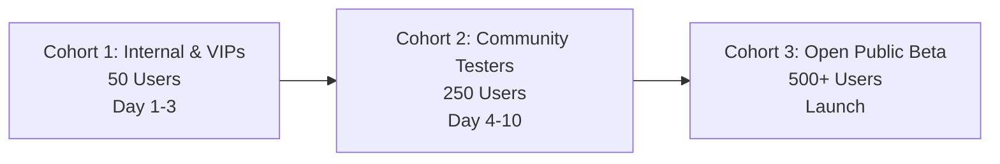

# NoteStandard Closed Beta Testing & User Validation Guide

**Version**: `v1.0.5-beta`  
**Target Audience**: Beta Coordinators, QA Engineers, Product Managers, and SREs

---

## 🎯 1. Closed Beta Objectives & Success Criteria

The primary goal of the NoteStandard Closed Beta is to validate real-world reliability, user experience, and performance across diverse devices and network conditions before opening the platform to the public.

### Key Success Metrics:
1. **Zero P1 Critical Defects**: No data loss, unauthorized access, or server crash loops.
2. **Satisfaction Rating**: Average tester rating $\ge 4.2 / 5.0$ across verified submissions.
3. **Messaging Latency**: Real-time message delivery P95 $< 250\text{ms}$ under multi-user traffic.
4. **Offline Resilience**: $100\%$ successful replay of messages drafted or queued while offline.

---

## 👥 2. Cohort Rollout Strategy

To safeguard platform stability, user onboarding is structured across three controlled stages:

### **Cohort 1: Internal Staff & Core Testers (50 Users)**
* **Focus**: Edge cases, network instability, browser matrix verification (iOS Safari, Android Chrome, macOS Safari, Windows Chrome).
* **Duration**: 72 hours.
* **Gate to next stage**: Zero unhandled 500 errors in Sentry; all P1/P2 issues resolved.

### **Cohort 2: Community Beta Testers (250 Users)**
* **Focus**: High concurrency messaging, profile discovery, image upload limits, group/direct chats.
* **Duration**: 7 days.
* **Gate to next stage**: Overall rating $\ge 4.2$; $\le 3$ open P3/P4 minor bugs.

### **Cohort 3: Public Beta**
* **Focus**: Full system capacity and transition to open registration.

---

## 📋 3. Beta Tester Scenario Matrix

Each tester should execute the following core verification flows:

| Scenario | Steps to Execute | Expected Result |
| :--- | :--- | :--- |
| **1. Auth & Profile Setup** | 1. Sign up / Sign in. 2. Upload an avatar and banner. 3. Edit Bio and social links. | Profile updates instantly and persists across page reloads. |
| **2. Realtime Chat** | 1. Open conversation with another tester. 2. Type and observe typing indicator. 3. Send message and watch delivery checkmarks. | Message appears in $< 100\text{ms}$; double ticks indicate delivery. |
| **3. Media Sharing** | 1. Attach and send an image ($< 5\text{MB}$). 2. Open lightbox preview. | Media compresses cleanly and displays without distortion. |
| **4. Offline Queue & Reconnect** | 1. Turn on Airplane Mode / disconnect WiFi. 2. Type and send a message (observing clock icon). 3. Re-enable network. | Message automatically sends upon reconnection without duplicates. |
| **5. Feedback Submission** | 1. Click floating **Beta Feedback** badge. 2. Select category, rate 1-5 stars, write notes. 3. Submit. | Feedback immediately logs to `/admin/beta-feedback` with browser telemetry. |

---

## 🐞 4. Bug Classification & Triage SLAs

| Severity | Definition | Target Resolution SLA |
| :--- | :--- | :--- |
| **P1 - Critical** | App crash on launch, security breach, message loss. | **$< 4\text{ hours}$** |
| **P2 - Major** | Feature broken with no workaround (e.g. upload fails for all users). | **$< 24\text{ hours}$** |
| **P3 - Moderate** | Visual glitch, minor layout defect, non-blocking UI anomaly. | **$< 72\text{ hours}$** |
| **P4 - Minor** | Feature suggestion, wording clarification. | **Backlog / Next Sprint** |

---

## 🛠️ 5. Managing Feedback & Triaging

1. Access the Admin Dashboard at [`/admin/beta-feedback`](file:///client/src/pages/admin/BetaFeedbackDashboard.tsx).
2. Filter by **🐛 Bugs** to see active issues with captured telemetry (`Route`, `Viewport`, `User Agent`).
3. Transition status from `New` $\rightarrow$ `In Review` $\rightarrow$ `Resolved`.
4. Add internal reproduction notes and link corresponding GitHub commits.

---

## 🏁 6. Beta Exit Checklist

- [ ] All Cohort 2 feedback tickets triaged and resolved.
- [ ] Realtime gateway error rate $< 0.1\%$ under continuous user interaction.
- [ ] No secret or token leaks identified in Sentry telemetry.
- [ ] Performance and accessibility standards verified across mobile and desktop.
