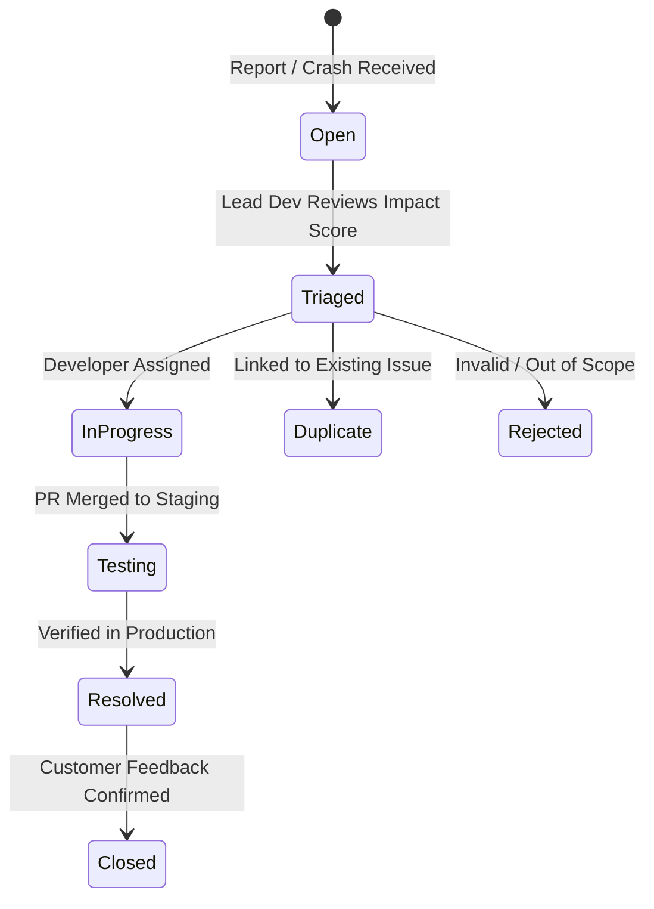

# NoteStandard Enterprise Feedback & Issue Tracking Operational Runbook

## Service Level Objectives (SLOs) & Targets

| Metric | Target / SLA | Mitigation / Alert Threshold |
| :--- | :--- | :--- |
| **API Availability** | 99.95% | Alert triggered if uptime drops below 99.90% |
| **Submission Latency** | < 250ms p95 | Alert triggered if p95 latency > 500ms for 5m |
| **Recovery Point Objective (RPO)** | < 1 Minute | Supabase WAL Point-In-Time Recovery (PITR) |
| **Recovery Time Objective (RTO)** | < 15 Minutes | Automated database container failover |
| **Crash-Free Sessions** | > 99.5% | Proactive Slack alert on spike in error rate |

---

## 1. Disaster Recovery & Backup Restoration

### Backup Procedures
- **Automated Point-in-Time Recovery (PITR)**: Supabase PostgreSQL continuous archiving with 30-day retention.
- **Daily Automated Physical Snapshots**: Run at 02:00 UTC and archived to multi-region S3 storage.

### Recovery Workflow
1. **Database Restore**:
   ```bash
   # Restore latest snapshot to staging environment
   supabase db restore --snapshot-id latest_daily_snapshot
   ```
2. **Offline Queue Sync Recovery**:
   When network connectivity drops, client submissions queue locally in IndexedDB. Upon back-online detection:
   - `feedbackOfflineQueue.ts` automatically executes exponential backoff retries.
   - Run manual queue flush script if needed:
     ```javascript
     window.flushOfflineFeedbackQueue();
     ```

---

## 2. Maintenance & Database Index Optimization

### Vacuum & Reindex Tasks
Run weekly database maintenance to ensure index query performance stays under 10ms:

```sql
-- Reindex main feedback tables
REINDEX TABLE feedback_reports;
REINDEX TABLE feedback_telemetry;
REINDEX TABLE feedback_attachments;

-- Vacuum analyze
VACUUM ANALYZE feedback_reports;
VACUUM ANALYZE feedback_telemetry;
```

---

## 3. Incident Triage Workflow



### Critical Severity Incident Escalation (P0/P1)
- If an issue is flagged as `critical` or has an Impact Score > 80:
  1. Automated PagerDuty / Slack P0 alert is dispatched to on-call engineer.
  2. Crash replay breadcrumbs are inspected in `/admin/beta-feedback`.
  3. If regression is detected, release rollback procedure is executed immediately.

---

## 4. Monitoring & Alert Thresholds

```json
{
  "alerts": [
    {
      "metric": "payment_failure_spike",
      "threshold": "> 3 failures per 10 minutes",
      "action": "Dispatch Slack P0 & raise priority to Critical"
    },
    {
      "metric": "crash_rate_high",
      "threshold": "Crash-free sessions < 99.0%",
      "action": "Trigger release health warning banner"
    },
    {
      "metric": "api_latency_spike",
      "threshold": "p95 > 800ms for 5 consecutive minutes",
      "action": "Notify backend ops team"
    }
  ]
}
```
