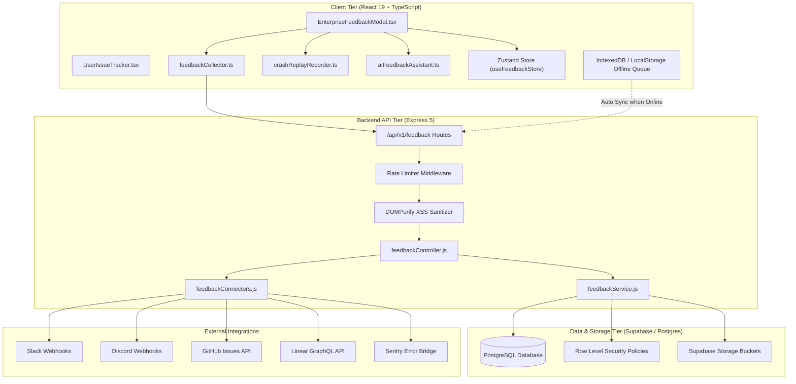
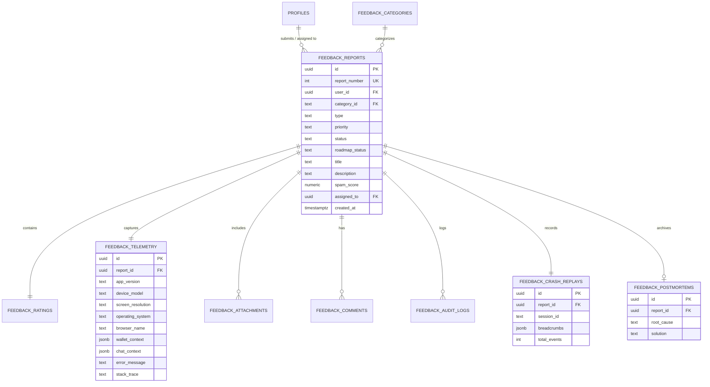
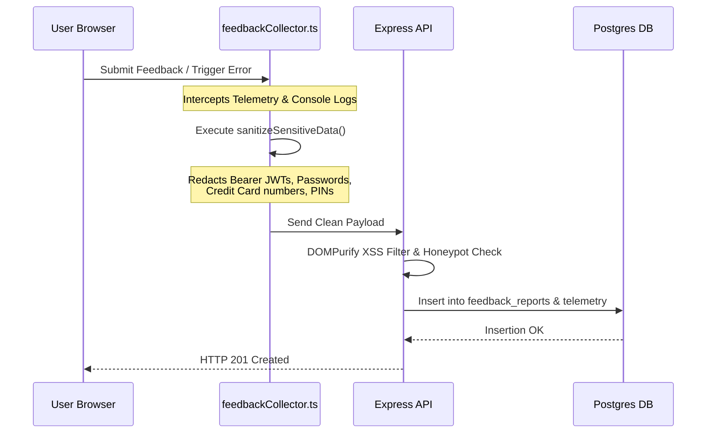

# NoteStandard Enterprise Feedback & Issue Tracking System Architecture

## System Overview

The Enterprise Feedback & Issue Tracking System is a mission-critical subsystem integrated directly into NoteStandard's Express backend and React 19 / TypeScript frontend. It handles user feedback, automated crash reporting, diagnostic telemetry harvesting, AI-assisted triage, release health metrics, and third-party integration connectors.

---

## Database Entity-Relationship Diagram (ERD)

---

## Security & Data Redaction Layer

